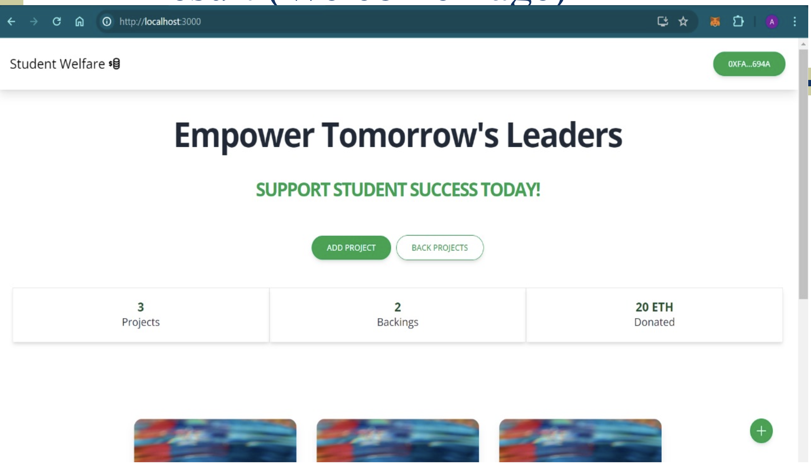
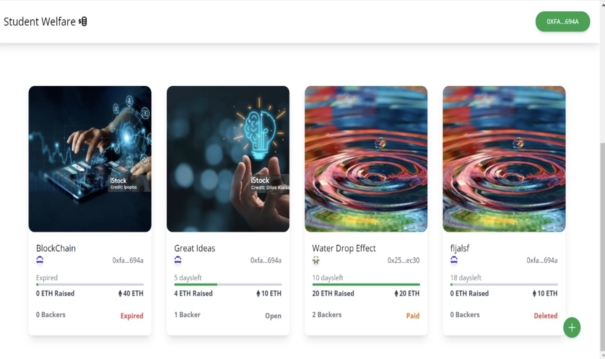
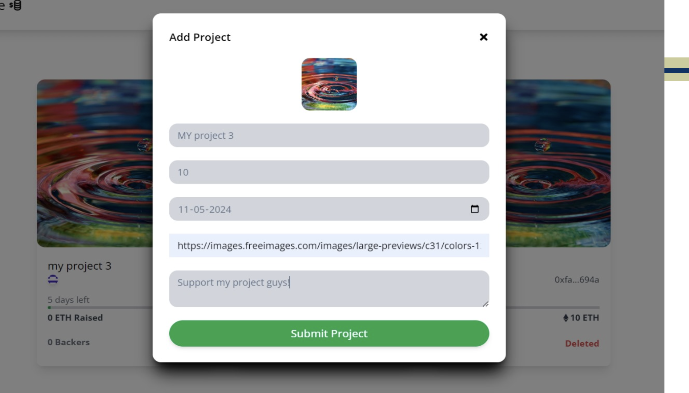
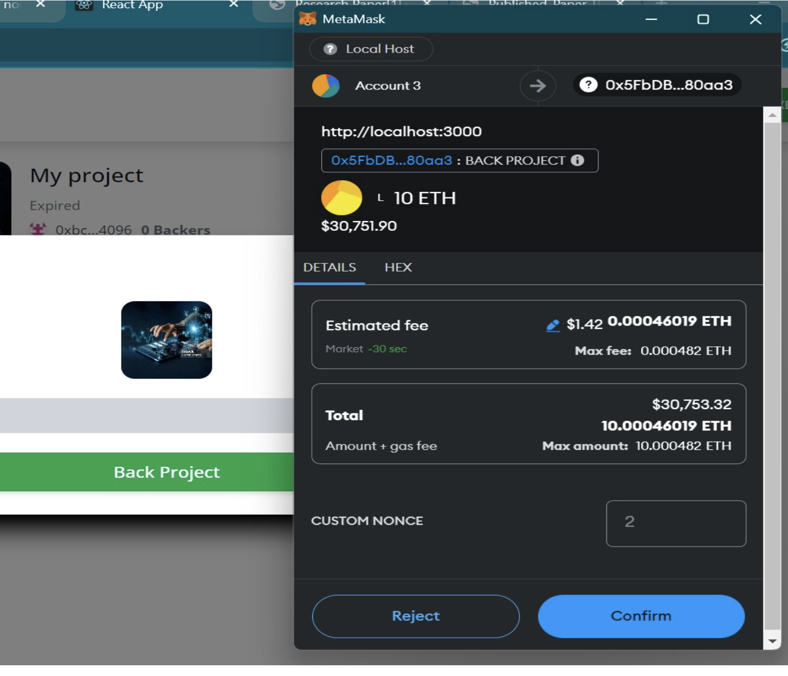

# THIS IS THE PROJECT RESULT

This shows the RESULT of the Project.

<figcaption>HOME PAGE</figcaption>

<figcaption> Projects</figcaption>

<figcaption> CREATE PROJECT PAGE</figcaption>

<figcaption> METAMASK LINKED</figcaption>

## Technology

This demo uses:

- Metamask
- Hardhat
- ReactJs
- Tailwind CSS
- Solidity
- EthersJs

## Useful links
- ⚽ [Metamask](https://metamask.io/)
- 🚀 [Remix Editor](https://remix.ethereum.org/)
- 💡 [Hardhat](https://hardhat.org/)
- 🔥 [ReactJs](https://reactjs.org/)
- 🐻 [Solidity](https://soliditylang.org/)
- 👀 [EthersJs](https://docs.ethers.io/v5/)
